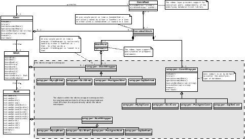

# What the rdbms layer of CTA does

The `rdbms` layer of CTA wraps the APIs of different relational database clients
in order to hide their syntactic differences from the rest of the CTA code base.

The `rdbms` library currently wraps the client APIs of the following 4 different
database management systems:

* MySQL
* Oracle
* PostgreSQL
* SQLite

# An example of the using the `rdbms` layer of CTA

One of the best ways to explain how to use the `rdbms` library is to give an
example.  The following code create a database table named `TEST`, inserts 2
rows into it and then queries the result:

```cpp
using namespace cta;

const auto login = rdbms::Login::parseString("in_memory");
const uint64_t maxNbConns = 1;
rdbms::ConnPool connPool(login, maxNbConns);
auto conn = connPool.getConn();

{
  const std::string sql = "CREATE TABLE TEST(ID INTEGER, VALUE VARCHAR(80))";
  auto stmt = conn.createStmt(sql);
  stmt.executeNonQuery();
}

{
  const uint64_t id = 1;
  const std::string value = "ONE";
  const std::string sql = "INSERT INTO TEST(ID, VALUE) VALUES (:ID, :VALUE);";
  auto stmt = conn.createStmt(sql);
  stmt.bindUint64(":ID", id);
  stmt.bindString(":VALUE", value);
  stmt.executeNonQuery();
}

{
  const uint64_t id = 2;
  const std::string value = "TWO";
  const std::string sql = "INSERT INTO TEST(ID, VALUE) VALUES (:ID, :VALUE);";
  auto stmt = conn.createStmt(sql);
  stmt.bindUint64(":ID", id);
  stmt.bindString(":VALUE", value);
  stmt.executeNonQuery();
}

{
  const std::string sql = "SELECT TEST.ID AS ID, TEST.VALUE AS VALUE FROM TEST ORDER BY ID";
  auto stmt = conn.createStmt(sql);
  auto rset = stmt.executeQuery();

  while (rset.next()) {
    std::cout << "ID=" << rset.columnUint64("ID")  << " VALUE='" << rset.columnString("VALUE") << "'" << std::endl;
  }
}
```

The following class diagram shows the most important design details of the `rdbms` layer:



